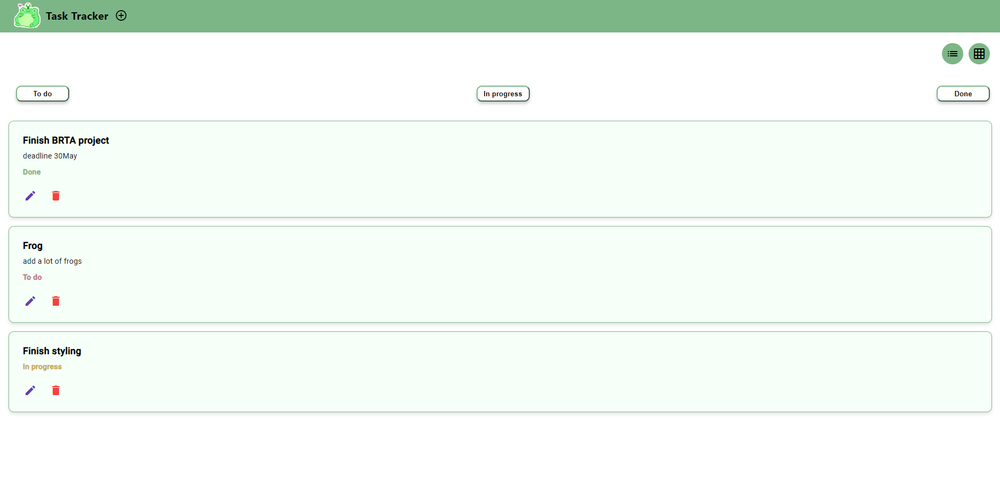
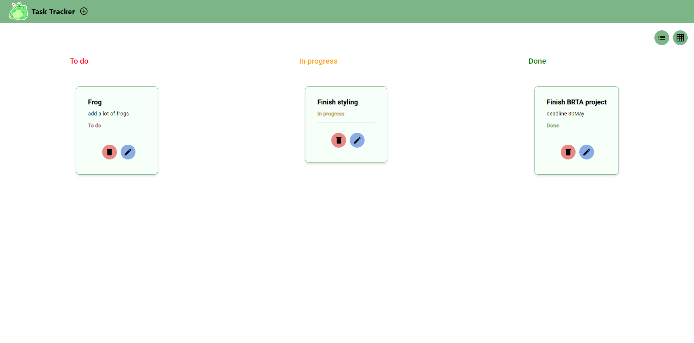
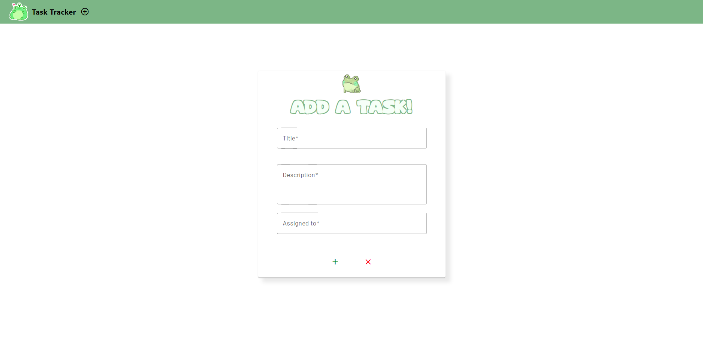
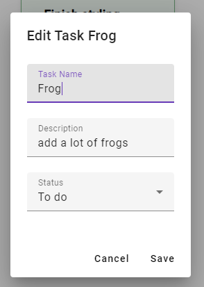

# Task-Tracker
Task tracking application using Angular, ASP Core & SignalR

Features:

-Connecting to a local database through an ASP Core API for storing tasks

-Ability to switch view from list to grid

-Add tasks & edit existing ones

-Dynamic status color for each task

List view of the tasks added:

Grid view of the tasks added:

Adding tasks:

Editing tasks:

